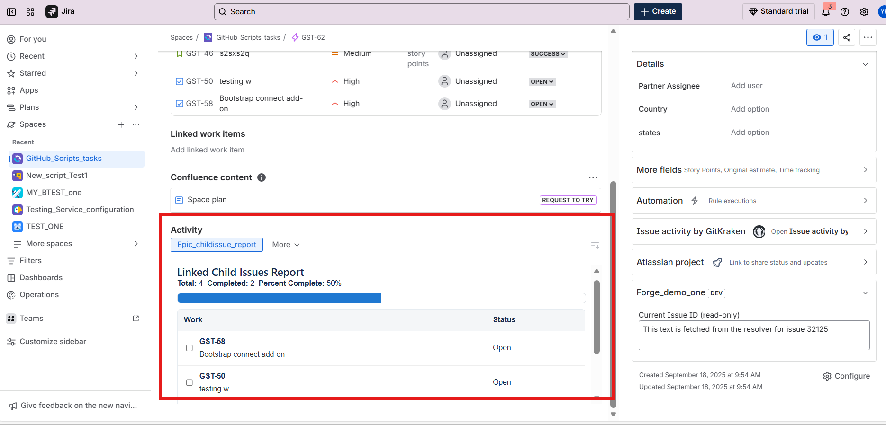

# Forge Epic child-issue reporting UI for Jira

## What this plugin does (short)

This Forge app provides an Epic child-issue reporting UI for Jira. When installed it adds a custom issue activity panel that helps teams view and track child issues of an Epic: it lists children, surfaces key fields such as status, assignee, and story points, and provides quick links and a compact progress snapshot for easier reporting and triage.



## Prerequisites

- Node.js (14+ recommended) and npm
- Forge CLI installed and authenticated. If you don't have it yet:

```powershell
npm install -g @forge/cli
forge login
```

Note: the Forge CLI requires you to be logged in. Use `forge login` and follow the browser flow.

## Quick start (Windows PowerShell)

1) Install dependencies (root and frontend):

```powershell
# from repo root
npm install
# then for the UI bundle
cd static/hello-world; npm install; cd -
```

2) Local frontend + tunnel (fast edit/reload workflow)

- In one terminal, start the React dev server so the UI can hot-reload while you edit:

```powershell
cd static/hello-world
npm start
```

- In another terminal (from the repo root) run the Forge tunnel. This proxies requests for your app's static files to the running dev server so the UI served in Jira/Confluence updates instantly.

```powershell
# in repo root
forge tunnel
```

With the dev server + tunnel running you can edit `static/hello-world/src/` and see UI changes in your Atlassian site immediately.

3) Build the frontend for production

```powershell
cd static/hello-world
npm run build
```

The build output will be placed in `static/hello-world/build/` and packaged by Forge when you deploy.

4) Lint, deploy and install the app

- (Optional) Run manifest/lint checks:

```powershell
# in repo root
forge lint
```

- Deploy to the development environment:

```powershell
forge deploy --non-interactive --environment development
```

- Install (or upgrade) the app on a site. Replace the placeholders with your site URL and product (jira or confluence):

```powershell
forge install --non-interactive --site https://your-site.atlassian.net --product jira --environment development
```

If you are upgrading an existing installation after changing scopes, use:

```powershell
forge install --non-interactive --upgrade --site https://your-site.atlassian.net --product jira --environment development
```

## Notes & troubleshooting

- If you change `manifest.yml` (module or scope changes) you must redeploy and then reinstall the app if scopes changed.
- To view runtime logs for troubleshooting:

```powershell
# show latest 100 log lines
forge logs -n 100
# or logs since 15 minutes
forge logs --since 15m
```

- If you use the tunnel workflow, remember:
	- Do not redeploy for code-only edits in your frontend — the tunnel + react dev server will hot-reload.
	- If you change the manifest, redeploy and (if needed) reinstall.

## Where to edit

- Backend / resolver: `src/index.js` (and other files under `src/`)
- Frontend UI: `static/hello-world/src/` (React + @forge/react UI Kit components)

## Manifest & deploy rules (short)

- Use `forge lint` to validate `manifest.yml` before deploy.
- Deploy with `forge deploy --non-interactive --environment <env>` (development by default is common during development).
- Install with `forge install --non-interactive --site <site-url> --product <jira|confluence> --environment <env>`.

## Support

Forge docs and help: https://developer.atlassian.com/platform/forge/get-help/

Happy forging — may your bugs be few and your issues be epic! (Forged with care.)
